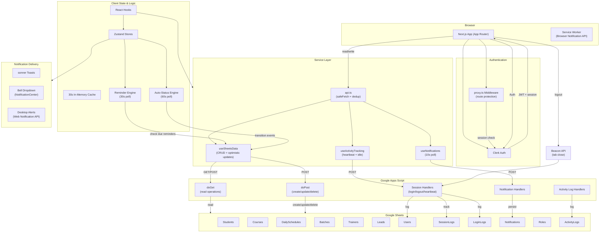

<div align="center">
  <h1>📊 SSP Global — STI TrackSuite</h1>
  <p><em>Enterprise Training & Student Management Platform</em></p>

  <p>
    <a href="https://ssp-global-sti-ts.vercel.app">
      
    </a>
    <a href="https://github.com/Jayakrishnasai/SSPGlobal_STI_TS">
      
    </a>
    <a href="https://github.com/Jayakrishnasai/SSPGlobal_STI_TS/blob/main/LICENSE">
      
    </a>
  </p>

  <p>
    
    
    
    
    
    
    
    
  </p>

  <p>
    
    
  </p>

  <br>
</div>

An **internal training institute management platform** for SSP Global. TrackSuite handles end-to-end administration of students, courses, batches, trainers, schedules, leads, and user sessions with role-based access control — all powered by Google Sheets as the operational data store.

---

## Tech Stack

| Layer | |
|-------|-|
| **Framework** | Next.js 16 (App Router, Turbopack) |
| **Language** | TypeScript 5 |
| **UI** | Tailwind CSS 4, Radix UI, shadcn/ui |
| **Auth** | Clerk v7 |
| **Charts** | Recharts |
| **Forms** | React Hook Form + Zod |
| **State** | Zustand |
| **Calendar** | FullCalendar |
| **Backend** | Google Apps Script + Google Sheets |
| **Notifications** | sonner (in-app) + Web Notification API |
| **Animations** | Framer Motion |

---

## Features

### Core Modules
- **Dashboard** — Stats overview, online users widget, real-time activity feed
- **Students** — Full CRUD with search and progress tracking
- **Courses** — Course catalog with active/inactive status
- **Batches** — Batch management linked to courses and trainers with status badges, progress bars, filter bar
- **Trainers** — Trainer profiles with specialization
- **Schedules** — Enterprise Event & Notification Platform
- **Leads** — Lead management with source tracking and follow-up dates
- **Analytics** — Charts for lead sources, student status distribution, enrollment trends, batch progress

### Enterprise Event & Notification Platform (Schedules Module)
- **9 Event Types** — Session, Meeting, Deadline, Webinar, Workshop, Office Hour, Reminder, Task, Break
- **4 View Modes** — Table (sortable/searchable), Timeline (visual flow), Calendar (FullCalendar), Activity (event log)
- **FullCalendar Integration** — Day, Week, Month, Agenda views with color-coded events per type
- **Rich Event Form** — Dynamic fields per event type, organizer, meeting links, participants, location, agenda
- **Status Workflow** — Scheduled → Running → Completed / Cancelled / Holiday / Postponed / PAP
- **Conflict Detection** — Overlapping events highlighted with warning banner and conflict count
- **Recurring Events** — Daily, Weekdays, Weekly, Biweekly, Monthly with configurable occurrence count
- **Auto-Status Transitions** — Frontend timer checks every 60s: Scheduled→Running (at start time), Running→Completed (at end time)
- **Reminder Engine** — Browser notification reminders at 5/15/30/60 min before and 1440 min (1 day) ahead, polled every 30s, with deduplication
- **Activity Logging** — Every create/update/delete/duplicate logged to `ActivityLogs` sheet with event title, type, action, and IST timestamp
- **Duplicate Events** — One-click duplicate to quickly clone an existing event
- **Meeting Link Support** — Copy-to-clipboard and join links for virtual sessions
- **Detail Sheet Panel** — Slide-over panel showing full event details

### Schedule Workflow
- **Status progression** — Scheduled → Running → Completed / Cancelled / Holiday / Postponed / PAP
- **IST timezone** — All timestamps stored in Indian Standard Time
- **Bulk creation** — Generate multiple schedule entries at once
- **Audit trail** — Created Time, Modified Time, Last Status Change Time tracked per entry

### User & Session Management
- **Clerk Authentication** — Sign-up/sign-in with email + password
- **Role-Based Access** — Super Admin, Admin, Trainer, Student, HR, Staff with middleware route protection
- **User Session Tracking** — Login/logout timestamps, last active heartbeat (2 min), idle detection (15 min)
- **Online Users Widget** — Live view of active users with status badges
- **Activity Tracking** — Mouse/keyboard/scroll idle detection with automatic status updates

### Notifications
- **Bell Dropdown** — Glassmorphism panel with dynamic type-based icons, grouped by Today/Yesterday/Earlier, unread dot indicator, mark all read, relative timestamps, framer-motion staggered entry, skeleton state, empty state
- **Desktop Notifications** — Browser Notification API for background tab alerts
- **Reminder Notifications** — Triple delivery (in-app + toast + browser) for event reminders
- **Auto-generated Events** — Welcome on signup, session started on login, bulk schedule creation

### UI/UX
- **Responsive** — Mobile-first with collapsible 260px sidebar
- **Dark Mode** — System-aware theme toggle via `next-themes`
- **Reusable DataTable** — Generic sortable/searchable/paginated component with loading/empty/error states
- **Optimistic Updates** — Snapshot → mutate → rollback on failure pattern across all CRUD
- **Framer Motion** — Page transitions, staggered row entrance, animated stat cards
- **safeFetch** — Detects HTML responses, invalid JSON, bad HTTP statuses before surfacing errors
- **30s Cache** — In-memory cache + request deduplication prevents concurrent duplicate fetches
- **Loading Skeletons** — Shimmer placeholders during data fetches
- **Toast Notifications** — Success/error toasts via sonner

---

## Project Structure

```
tracking-app/
├── apps-script/              # Google Apps Script backend
│   ├── Code.gs               # API handlers (CRUD, notifications, session tracking, events)
│   └── Setup.gs              # Sheet creation & role seeding
├── public/                   # Static assets
├── src/
│   ├── app/                  # Next.js App Router pages
│   │   ├── dashboard/        # Dashboard + sub-pages
│   │   │   ├── analytics/    # Charts & metrics
│   │   │   ├── batches/      # Batch management
│   │   │   ├── calendar/     # FullCalendar view
│   │   │   ├── courses/      # Course catalog
│   │   │   ├── leads/        # Lead management
│   │   │   ├── schedules/    # Enterprise Schedules (4 views)
│   │   │   ├── settings/     # App settings
│   │   │   ├── students/     # Student management
│   │   │   └── trainers/     # Trainer profiles
│   │   ├── sign-in/          # Clerk sign-in page
│   │   └── sign-up/          # Clerk sign-up page
│   ├── components/
│   │   ├── charts/           # Recharts components
│   │   ├── common/           # ThemeProvider, UserSync, loading skeletons
│   │   ├── dashboard/        # Online users widget, activity feed
│   │   ├── events/           # NotificationCenter, ActivityTimeline
│   │   ├── forms/            # EventForm, ScheduleForm, StudentForm, etc.
│   │   ├── layout/           # Sidebar, Navbar (with notification bell)
│   │   ├── tables/           # Reusable DataTable component
│   │   └── ui/               # shadcn/ui primitives
│   ├── stores/               # Zustand stores (notificationStore)
│   ├── hooks/                # useSheetsData, useActivityTracking, useNotifications
│   ├── services/             # API layer (safeFetch, cache, deduplication)
│   ├── constants/            # Sheet names, time intervals, roles
│   ├── types/                # TypeScript interfaces (AppEvent, ActivityLogEntry, etc.)
│   ├── lib/                  # Animation variants, utilities
│   ├── utils/                # Utility functions
│   └── proxy.ts              # Clerk route protection middleware
└── .env.local                # Environment variables
```

---

## Getting Started

### Prerequisites
- Node.js 20+
- Google Account (for Apps Script + Sheets)
- Clerk Account

### 1. Clone & Install

```bash
git clone https://github.com/Jayakrishnasai/SSPGlobal_STI_TS.git
cd tracking-app
npm install
```

### 2. Set Up Clerk

1. Create an app at [clerk.com](https://clerk.com)
2. Enable **Email** under Users & Authentication
3. Copy the **Publishable Key** and **Secret Key**

### 3. Set Up Google Apps Script

1. Create a new Google Sheet
2. Go to **Extensions → Apps Script**
3. Copy `apps-script/Setup.gs` and `apps-script/Code.gs` into the editor
4. Run `setupSheets()` to create all sheets
5. **Deploy → New Deployment → Web App**:
   - Execute as: **Me**
   - Access: **Anyone**
6. Copy the deployment URL

### 4. Environment Variables

Create `.env.local`:

```env
NEXT_PUBLIC_GOOGLE_SCRIPT_URL=https://script.google.com/macros/s/YOUR_ID/exec
NEXT_PUBLIC_APPS_SCRIPT_URL=https://script.google.com/macros/s/YOUR_ID/exec

NEXT_PUBLIC_CLERK_PUBLISHABLE_KEY=pk_test_xxxxxxxxxx
CLERK_SECRET_KEY=sk_test_xxxxxxxxxx
```

### 5. Set User Roles

In **Clerk Dashboard → Users → [user] → Metadata**, add:

```json
{ "role": "Super Admin" }
```

Available roles: `Super Admin`, `Admin`, `Trainer`, `Student`, `HR`, `Staff`

### 6. Run

```bash
npm run dev
```

Open [http://localhost:3000](http://localhost:3000).

---

## Data Model

| Sheet | Key Columns |
|-------|-------------|
| **Students** | Student ID, Full Name, Email, Course, Batch, Status, Progress |
| **Courses** | Course ID, Name, Modules, Duration, Status |
| **DailySchedules** | Task ID, Batch, Date, Start/End Time, Status, Event Type, Title, Organizer, Meeting Link, Participants, Location, Agenda, Reminders, Recurrence |
| **Leads** | Lead ID, Name, Contact, Source, Course, Status, Follow-up |
| **Trainers** | Trainer ID, Name, Email, Phone, Specialization, Status |
| **Batches** | Batch ID, Name, Course, Trainer, Start Date, Status |
| **Users** | User ID, Name, Email, Role, Login/Logout, Last Active, Status |
| **SessionLogs** | Log ID, User ID, Login/Logout, Duration, Device, Browser, IP |
| **LoginLogs** | Log ID, User ID, Action, Timestamp |
| **Notifications** | Notification ID, User ID, Title, Message, Type, Link, Is Read, Created At |
| **Roles** | Role Name, Permissions |
| **Analytics** | Metric Name, Value, Last Updated |
| **ActivityLogs** | Log ID, Event ID, Action, Details, Timestamp (IST), Event Title, Event Type |

---

## Architecture



| Layer | Role |
|-------|------|
| **Clerk** | Authentication, session management, user metadata (`publicMetadata.role`) |
| **Next.js (App Router)** | Frontend rendering, API routing via `proxy.ts` middleware, client-side role checks |
| **Zustand** | Client-side notification state, reminder cycle, triple-delivery (in-app + toast + browser) |
| **Google Apps Script** | REST API — CRUD operations, session tracking, notification CRUD, heartbeat updates, activity logging |
| **Google Sheets** | Operational data store — 12 sheets (13 including ActivityLogs) |

### Key Design Decisions

- **No database server** — Google Sheets acts as the sole data store via Apps Script REST API
- **30s in-memory cache** on reads + request deduplication to mitigate Google Sheets 1–3s latency
- **Optimistic UI** — snapshot → mutate → rollback on failure pattern across all mutations
- **Reminder engine runs client-side** — Zustand store polls every 30s for due reminders, sends triple-notification (in-app toast + browser Notification API + Zustand state), with deduplication via `sentReminderKeys` set
- **Auto-status transitions** — Frontend timer checks every 60s: Scheduled→Running (at start), Running→Completed (at end)
- **Recurring events** generated on creation via `generateRecurringDates()`, stored as individual rows
- **Conflict detection** — Frontend scans for overlapping date/time ranges across events
- **Notifications persisted to global Notifications sheet** via existing `callSessionAction("createNotification")` pipeline
- **Beacon API** for reliable logout detection on tab close
- **Middleware** (`proxy.ts`) — pure auth-only route protection; role checking is client-side

---

## Scripts

| Command | Description |
|---------|-------------|
| `npm run dev` | Start dev server (Turbopack) |
| `npm run build` | Production build |
| `npm run start` | Start production server |
| `npm run lint` | Run ESLint |
| `npm run deploy:apps-script` | Push Apps Script files via clasp |
| `npm run deploy:apps-script:prod` | Push and deploy new Apps Script version |

---

## Performance Notes

- Google Sheets has **1–3s latency** per operation. In-memory caching (30s TTL) + optimistic updates mask this.
- Activity heartbeats are throttled to 2-minute intervals; idle detection at 15 minutes.
- Notification polling runs every 10 seconds; reminder engine polls every 30 seconds.
- Auto-status transitions check every 60 seconds.
- For production scale, consider migrating to **Supabase** (PostgreSQL).

---

## Deployment

Deployed on **Vercel**. To deploy your own:

1. Push to GitHub
2. Import repo in Vercel
3. Set environment variables in Vercel Dashboard
4. Deploy

---

## Changelog

### v3.0 — Enterprise Event & Notification Platform
- **Schedules Module** — Complete rewrite into 4-view enterprise platform:
  - **9 Event Types**: Session, Meeting, Deadline, Webinar, Workshop, Office Hour, Reminder, Task, Break
  - **4 View Modes**: Table (sortable/searchable), Timeline (visual event flow), Calendar (FullCalendar), Activity (event audit log)
  - **FullCalendar** — Day, Week, Month, Agenda views with per-type color coding
  - **Rich Event Form** — Dynamic fields per event type, organizer, meeting links, participants, location, agenda
  - **Conflict Detection** — Overlap detection with warning banner and conflict count
  - **Recurring Events** — Daily, Weekdays, Weekly, Biweekly, Monthly with occurrence count
  - **Auto-Status**: Scheduled→Running→Completed transitions every 60s
  - **Event Duplication** — One-click clone events
- **Reminder Engine** — Zustand store polls every 30s for due reminders at 5/15/30/60/1440 min before events; triple-delivery (in-app toast + browser Notification API + Zustand state); deduplication via `sentReminderKeys`
- **Activity Logging** — New `ActivityLogs` sheet (7 columns), all event mutations logged with action, timestamp (IST), event title/type
- **Notification Center** — `NotificationCenter` component (bell icon + dropdown) with animated unread badge, type-colored notifications, mark-read/mark-all-read/clear/dismiss
- **Activity Timeline** — `ActivityTimeline` component with action-specific icons/colors, sorted newest-first, loading skeleton, empty state
- **Zustand Store** — `notificationStore` with `sendNotificationTriple()`, `runReminderCycle()`, `checkAndUpdateAutoStatus()`, `startPolling()` with 30s/60s intervals
- **Backend Update** — `DailySchedules` now 22 columns (added `Reminders`, `Recurrence`), new `ActivityLogs` sheet, new deployment @14/15/16
- **Google Sheets Schema** — `Reminders` stored as comma-separated string (e.g. `"5,15,30"`), `Recurrence` as JSON string

### v2.0 — Theme System Refactor & Apps Script Overhaul
- **Centralized design tokens** — `globals.css` rewritten with light/dark CSS variables
- **Flicker-free theme switching** — reduced transitions, `.disable-transitions` class
- **Semantic CSS variables everywhere** — replaced hardcoded colors with `bg-popover`, `bg-accent`, `border-border`
- **Recharts theme re-mount** — all 4 chart components force re-render on theme switch via `key={theme}`
- **Apps Script backend** — added 4 missing handlers (`getCachedMetrics`, `computeAndStoreMetrics`, `getRoles`, `getRoutesForRole`)
- **clasp automation** — `.clasp.json`, `.claspignore`, `appsscript.json`, npm scripts for CLI deployment
- **New components** — `AccentThemeContext`, `ProgressBar`, `ConfirmDialog`, `StatsGrid`, `StatusBadge`, `Switch`
- **Dead code removed** — `sheets.ts`, `analytics.ts`, `SIDEBAR_ITEMS`, `ITEMS_PER_PAGE`

### v1.5 — DataTable Component & Dark Mode Improvements
- **Reusable `<DataTable>`** — generic TypeScript component with sortable columns, client-side search, pagination, loading/empty/error states

### v1.4 — Sidebar & Batches Page Redesign
- **Sidebar redesigned** — sectioned layout, logo area, active indicator line, user footer
- **Batches page redesigned** — stat cards, filter bar, sortable table, status badges, progress bars, pagination

### v1.3 — Framer Motion Animations
- **Animations library** — reusable variants in `src/lib/animations.ts`

### v1.2 — Push Notifications & Error Resilience
- **Push notification system** — `useNotifications` hook, bell icon, desktop Notification API
- **Error resilience (`safeFetch`)** — HTML detection, JSON validation, toast on error

### v1.1 — Session Tracking & Clerk Fixes
- **User session tracking** — login/logout, heartbeats, idle detection, online users widget
- **Role-Based Access Control (RBAC)** — middleware + client-side role checks

### v1.0 — Initial Release
- Clerk auth, Google Sheets backend, 6 CRUD modules, dashboard, analytics

---

## License

Private — SSP Global

---

Made with ❤️💕 SSP Global_STI_SS 💕❤️
